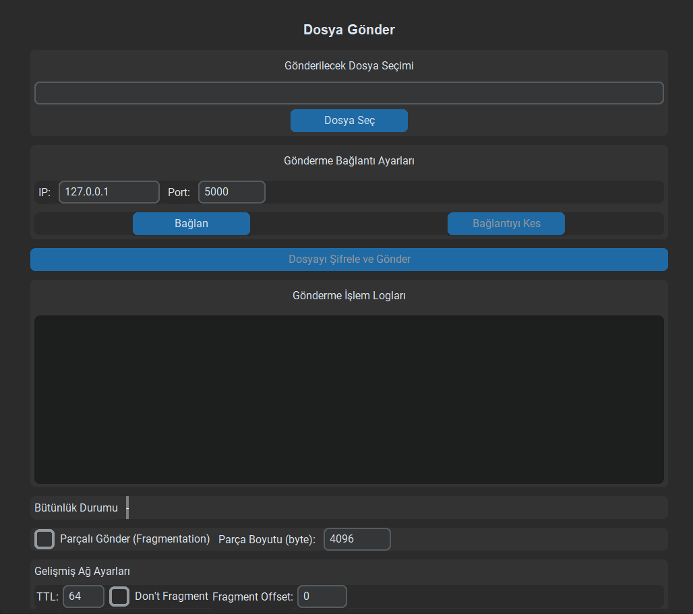
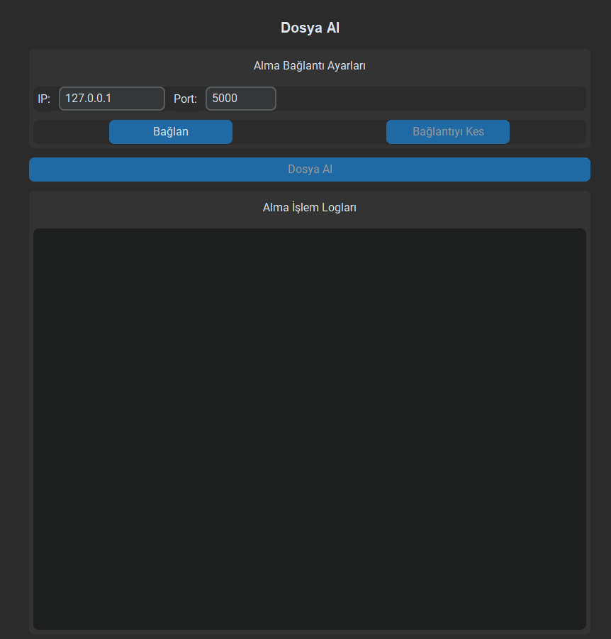
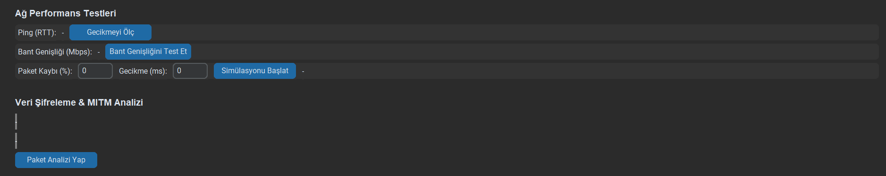

# 🔐 Güvenli Dosya Transfer Sistemi

Bu proje, IP başlıklarını manuel olarak işleyerek, AES şifreleme ve SHA-256 bütünlük kontrolü kullanarak güvenli bir dosya transferi sağlar. Ayrıca gecikme, bant genişliği ve paket kaybı gibi ağ performans ölçümleri içerir. GUI arayüzü ile kullanıcı dostu bir deneyim sunar.

---

## 📌 Proje Özellikleri

### ✅ Temel İşlevler

* 🔄 Dosya Gönderme/Alma (TCP ile)
* 🔐 AES-256-CBC ile veri şifreleme
* 🧾 SHA-256 hash ile bütünlük kontrolü
* 📦 Manuel IP başlık düzenlemesi (TTL, DF, offset, checksum)
* 🧩 Komut Protokolü: `SEND`, `RECEIVE`

### 🔐 Güvenlik

* Her dosya için rastgele üretilen anahtar ve IV
* Şifreli verinin bütünlüğü için SHA-256 kontrolü
* Scapy kullanılarak parçalama (fragmentation)
* Elle IP checksum hesaplaması

### 📡 Ağ Performans Ölçümleri

* 📍 Gecikme (ping & TCP bağlantı süresi)
* 📶 Bant genişliği (socket süreye dayalı test)
* 📉 Paket kaybı ve gecikme simülasyonu (yazılımsal)
* 🔍 Paket başlığı analizi (TTL, port, protokol, içerik)

### 🖥 GUI (CustomTkinter)

* Dosya seçimi, TTL/DF girişi, gönder/al butonları
* Log ekranı ve durum göstergeleri
* Ağ testi ve paket simülasyon paneli

---

## 📁 Proje Dosya Yapısı

```bash
├── alinacak_dosya/      # Alınan dosyanın klasörü
├── gonderilecek_dosya/  # Gönderilecek dosyanın klasörü
├── main.py              # Uygulama başlatma
├── gui.py               # Grafik kullanıcı arayüzü
├── security.py          # AES + SHA256 işlemleri
├── server.py            # Dosya alıcı sunucu
├── transfer.py          # IP başlık yönetimi ve veri gönderme
├── network_tools.py     # Ping, bandwidth, analiz, simülasyon
├── requirements.txt     # Gerekli yüklemeler
├── README.md            # README
└── assets/              # Görsel ve ekran görüntüleri
```

---

## ⚙️ Kurulum

### Gereksinimler

```bash
pip install requirements.txt
```

### Uygulama Başlatma

```bash
python main.py
```

GUI başlar ve sunucu arka planda çalışır.

---

## 📈 Örnek Kullanım

1. Dosya seçin
2. IP adresi ve port girin
3. IP başlık parametrelerini yapılandırın
4. Gönder tuşuna tıklayın
5. Sunucu veriyi alır → Şifresini çözer → Hash doğrular → Dosyayı kaydeder

---

## 📷 Ekran Görüntüsü

| Dosya Gönder Paneli      | Dosya Al Paneli             |
| ------------------------ | --------------------------- |
|  |  |

| Ağ Performans Testleri Paneli      |
| ------------------------ |
|  |

---

## 🚧 Kısıtlamalar

* RSA veya sertifika tabanlı kimlik doğrulama yok
* UDP ya da QUIC desteği henüz eklenmedi
* Büyük dosyalar belleğe tamamen alınır (stream desteklenmiyor)

---

## 💡 Geliştirme Önerileri

* Stream bazlı dosya okuma/yazma
* RSA + AES hibrit şifreleme
* QUIC, UDP protokol desteği
* Gerçek zamanlı paket trafiği görselleştirme
* X.509 sertifika tabanlı kimlik doğrulama

---

## 🧪 Kullanılan Teknolojiler

* Python 3.x
* Scapy
* Cryptography
* CustomTkinter
* Wireshark, iPerf3, tc (analiz için)

---

## 👤 Geliştirici

**İbrahim Semih Temiz**
📧 [E-Posta](mailto:semhtemiz@gmail.com)
🔗 [LinkedIn](https://linkedin.com/in/semihtemiz)

---

## 📝 Lisans

MIT Lisansı © 2025 — Akademik kullanım içindir.
